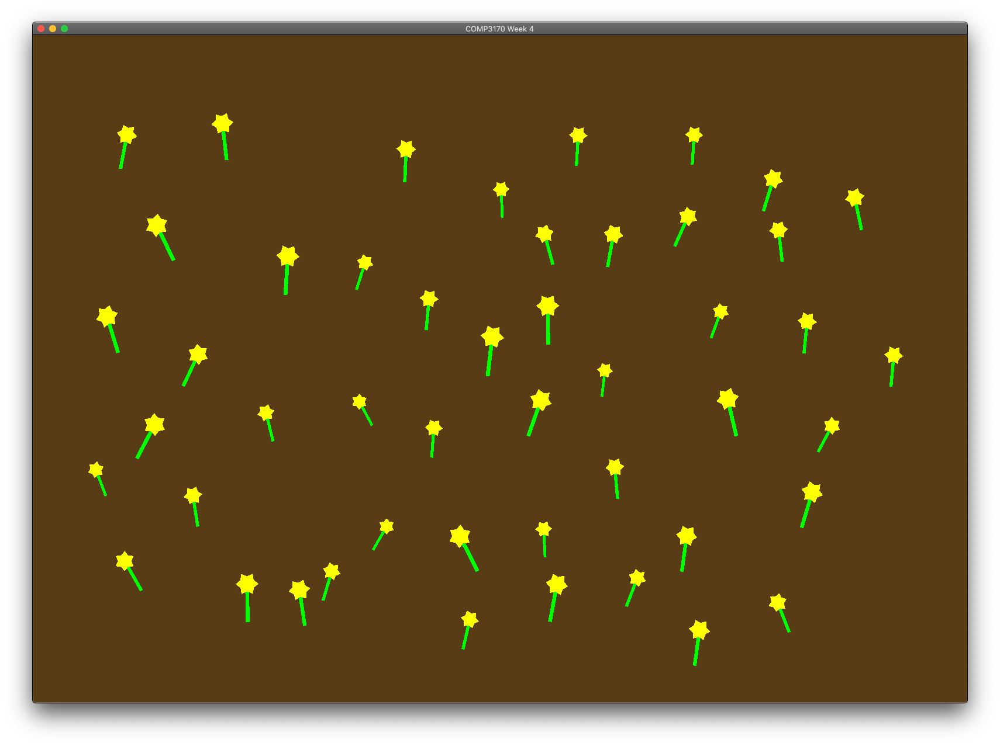

# COMP3170 - Week 4: Mesh Generation and Cameras

In this prac you are going to create a flower garden that looks like this:

To achieve this, you'll need to draw triangles in 2D, apply matricies using JOML, change the view & projection matricies, and utilise mouse input.

Inside the template code for today, you'll see the following classes:
* Week4.java: the base IWindowListener
* Flower.java: code for drawing a flower
* Transform.java: methods to create translation, rotation and scale matrices

Hopefully by now the code should be familiar enough for you to find your own way around. The framework provided draws a single flower stem at (0,0). You task is to complete the parts labelled `TODO` in the code. 

## Draw a flower
`Flower.calcModelMatrix():` Calculate the model matrix in TRS order to draw the flower at the given position, angle and scale.

`Flower():` Calculate the vertices for the head of a flower with the specified number of petals. Vertices should be laid out like this:

Draw the flower in your workbook, as a set of triangles. What is the simplest triangulation of the shape above?

`Flower.draw():` Add code to draw the head of the flower at the top of the stem. (Hint: add a translation to the world matrix to move the coordinate frame). Test that this works when the flower is moved, rotated and scaled.
 
## Scale the camera view

`vertex.glsl:` Add uniforms and code to implement view and projection matrices.

In your workbook, draw the window showing the coordinates of each corner in:
* viewport (i.e. pixel) coordinates
* world coordiantes
* view (i.e. camera certric) coordinates
* NDC 

What is the transformation from world to view coordinates (i.e. the view matrix)?

What is the transformation from view to NDC (i.e. the projection matrix)?

`Week4.draw():` Add code to set the view and projection matrices, so you can see a larger field of view. [TODO: Should this be in scene?]

What happens when you resize the window? Why is this happening?

Draw the correct mapping that takes the aspect ratio of the window into account.

`Week4.resize():` Add code to change the projection matrix to match the aspect ratio of the window when it is resized.

# Add interactivity

`Week4.update():` Check whether the mouse has been clicked and create a new flower (adding it to the flowers list). Set the position of the new flower to the mouse position. To do this you will need to:
* Get the mouse position from the input manager (in NDC)
* Convert this to world coordinates by multiplying by the inverse camera matrix.

Remember: the view & projection matrices convert from world to NDC, so the inverse will convert from NDC to world.

`Flower.update():` Animate the flowers to sway in the wind, and make the heads rotate.

